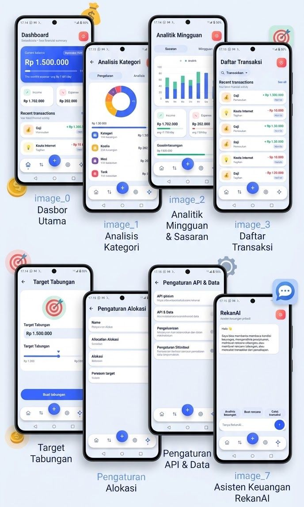

<div align="center">

# RekanKelola

**A personal finance manager for Android with on-device AI, receipt scanning, and category budgeting — built entirely in Kotlin, no XML layouts.**

[](https://developer.android.com)
[-blue)](https://developer.android.com/tools/releases/platforms)
[](https://kotlinlang.org)
[](#license)

</div>

---

## Showcase



---

## About

RekanKelola is a personal finance tracker built for people who want more than a plain transaction list. It combines manual bookkeeping with an AI assistant, offline receipt scanning, percentage-based category budgets, and a smart notification system — all packed into a single-file, dependency-light Android app written in pure Kotlin with a fully custom, programmatically built UI (no XML layout files for the app screens).

The project was built solo, from scratch, as a real daily-use application rather than a tutorial project. Every feature listed below is implemented and working in the current codebase.

---

## Features

### Core bookkeeping

- **Transaction tracking** — log income and expenses with custom categories and notes.
- **Savings targets** — create financial goals with a target amount, deadline, and priority level, and track progress toward each one.
- **Dashboard overview** — current balance, total income, total expense, and recent transaction history at a glance.

### AI-powered assistant (RekanAI)

- Built-in conversational assistant powered by the Google Gemini API, using the user's own API key.
- Can analyze the user's current financial condition, suggest a savings plan, and log transactions directly from natural-language chat (for example, telling it "I spent 25k on lunch" logs the transaction automatically).
- **Automatic model discovery**: instead of hardcoding a single Gemini model name, the app queries the available models for the provided API key and tries them in priority order. If a model becomes deprecated or unavailable, the app automatically falls back to the next working model — no code changes or app updates required when Google retires a model.

### Offline receipt scanning

- Long-press the add button to open the camera and photograph a receipt.
- Text is extracted on-device using Google ML Kit Text Recognition — fully offline, free, and with no API key required.
- A parser identifies the total amount and merchant name from the recognized text and pre-fills the transaction form for the user to review and confirm before saving. Nothing is auto-saved without confirmation, and no receipt image or data ever leaves the device.

### Category budgeting

- Users define a percentage split for categories such as savings, transport, and entertainment in Settings.
- The app calculates a live budget for each category from the current balance and tracks how much of it has been spent this month.
- Each category is shown with a progress bar that shifts from its normal color to orange as it approaches its limit, and to red with an explicit "budget exhausted" message once the limit is reached — so the user always knows exactly how much room is left in each category before overspending.

### Smart notifications

- **Daily reminder** at 23:40 to log the day's transactions, delivered as a heads-up notification, scheduled with `AlarmManager` and rescheduled automatically after every device reboot.
- **Automatic financial insights**, triggered right after a transaction is recorded:
  - Large incoming payment detected — suggests setting money aside in savings.
  - High spending detected for the day — flags when daily spending crosses a threshold.
  - Low balance warning — alerts the user when the remaining balance is running low.
  - Category budget exhausted — fires when a percentage-based budget (e.g. transport) is fully spent for the month.
- All insight notifications are rate-limited per category so the user is informed without being spammed.

### Multi-language interface

- Supports **English, Indonesian, Chinese (Simplified), and Russian**, with English as the default for new installs.
- The active language is switchable anytime from Settings, with the choice persisted across app restarts.
- Built on a lightweight custom localization layer (no `strings.xml` / `values-xx` resource files), matching the app's fully programmatic UI architecture.

---

## Technical overview

| | |
|---|---|
| Language | Kotlin |
| UI | Fully programmatic (no XML layouts), custom-built views and dialogs |
| Minimum SDK | 24 — Android 7.0 (Nougat) |
| Target SDK | 34 — Android 14 |
| Compile SDK | 36 |
| AI backend | Google Gemini API (user-supplied API key, automatic model discovery and fallback) |
| OCR | Google ML Kit Text Recognition (on-device, offline) |
| Notifications | `AlarmManager` + `BroadcastReceiver`, survives device reboot |
| Persistence | Local on-device storage |
| Localization | Custom key-based translation system, 4 languages |

RekanKelola targets Android 7.0 and above, which means it runs on the overwhelming majority of Android devices in active use today, while still building against the latest Android 14 APIs and behaviors.

---

## Project structure

```
MainActivity.kt          Main activity — all screens, dialogs, and app logic
BudgetTracker.kt          Category budget calculation and progress tracking
InsightAnalyzer.kt        Automatic financial insight detection
NotificationHelper.kt     Notification channels, permissions, and delivery
ReminderScheduler.kt      Daily 23:40 reminder scheduling (AlarmManager)
ReminderReceiver.kt       Handles the daily reminder alarm trigger
BootReceiver.kt           Reschedules alarms after device reboot
ReceiptScanActivity.kt    Camera capture + ML Kit OCR pipeline for receipts
ReceiptParser.kt          Extracts amount and merchant name from OCR text
LocaleManager.kt          Language persistence and locale application
Strings.kt                All UI text across 4 supported languages
```

---

## Roadmap

The following features are planned but not yet implemented:

- Automatic backup to Google Drive when a fast, stable connection is detected
- Data visualization (spending charts and monthly trend graphs)
- PIN / biometric app lock
- Full localization coverage across every screen (currently the dashboard is fully localized; some other screens still default to Indonesian)

---

## Contributing

This project started as a solo, personal-use application, but contributions, issue reports, and suggestions are genuinely welcome. If you find a bug, have an idea for a feature, or want to help with the localization coverage, feel free to open an issue or a pull request.

If you find RekanKelola useful or interesting, consider giving it a star — it helps the project reach more people and keeps development going.

---

## License

MIT
